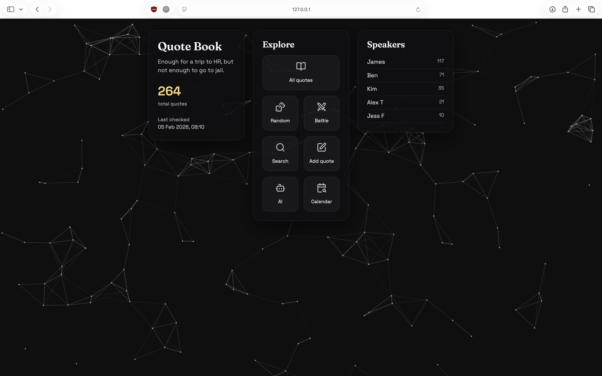
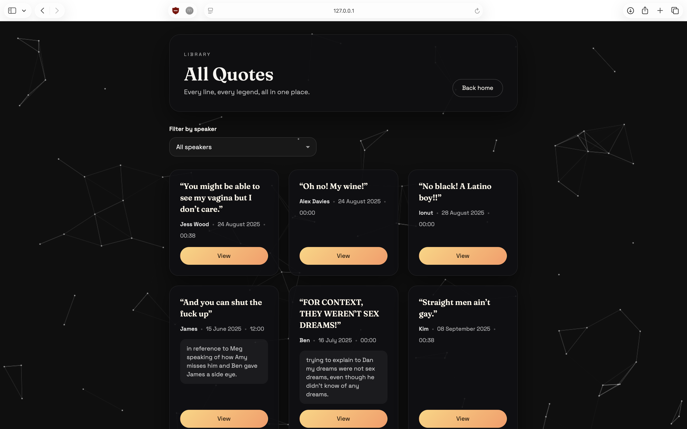
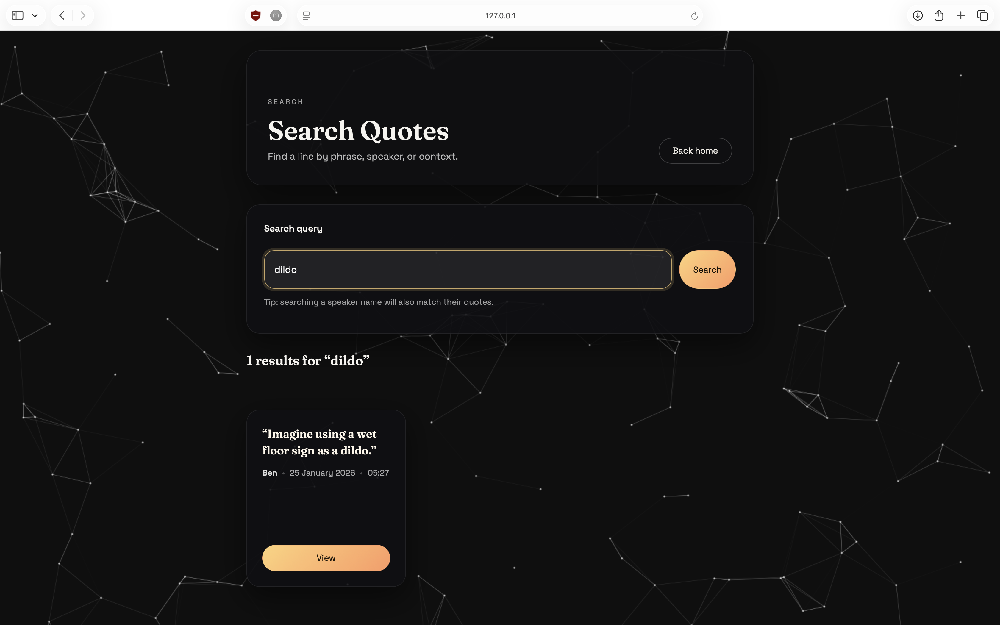
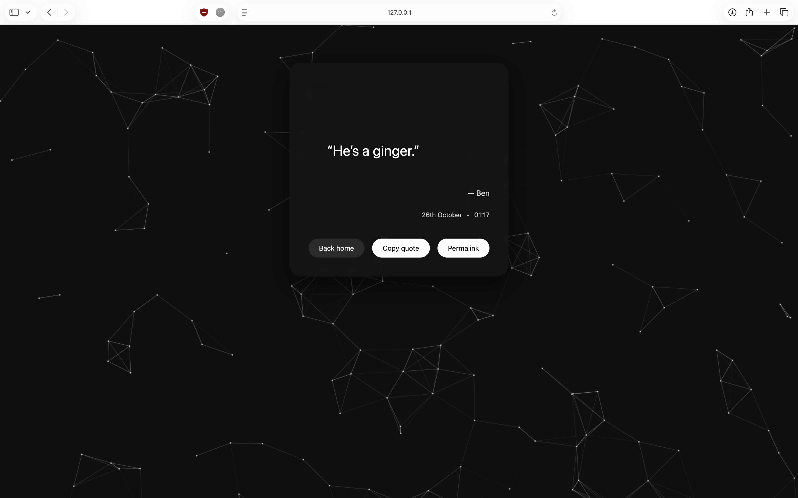

# QuoteBookWebPage

A simple **Flask‑powered web application** that lets you browse and share your Quote Book as a neat, user‑friendly web page.

This project takes your collection of quotes (like your **Spoons Quotes quote book**) and renders them in an interactive, searchable, and beautifully formatted website — perfect for sharing with friends or publishing online. Quotes are stored in a local SQLite database (`qb.db`).

---

## Features

- See quotes beautifully displayed in a web interface
- Built with **Flask** for simplicity and extensibility
- Frontend with HTML/CSS/JS in `templates/` and `static/`
- Python backend in `app.py`
- SQLite storage (`qb.db`) with automatic migration from `qb.qbf`
- Animated background canvas with a dark theme
- Optional weekly email digest (Monday 07:00 UK)
- Easily deploy locally or on hosting like **Render / Heroku / GitHub Pages (via static export)**

---

## Getting Started

### Prerequisites

Make sure you have the following installed:

- Python 3.8+
- pip (Python package manager)

### Setup

1. Clone the repo:

   ```git
   git clone https://github.com/benjjvi/QuoteBookWebPage.git
   cd QuoteBookWebPage
   ```

2. Install dependencies:

    ``` bash
   python -m pip install -r requirements.txt
   ```

3. Set up environment. There is an example version in `example.env`.

4. Set up your quote book. There is an example in `qb.qbf.template`.

   On first run, the app will automatically migrate `qb.qbf` into `qb.db` if the database is empty.

5. Run the app:

    ``` bash
   python app.py
   ```

6. Open your browser and navigate to 127.0.0.1:8040

### Optional launcher

Use the interactive launcher to pick client/server (and standalone mode):

```bash
python run.py
```

### Weekly email digest (optional)

You can send a weekly digest email every **Monday at 07:00 UK time**.

Set these environment variables:

```bash
WEEKLY_EMAIL_ENABLED=true
WEEKLY_EMAIL_FROM="quotes@example.com"   # optional if SMTP_USER is set
SMTP_HOST="smtp.example.com"
SMTP_PORT=587
SMTP_USER="smtp_username"
SMTP_PASS="smtp_password"
SMTP_USE_TLS=true
SMTP_USE_SSL=false
```

Recipients are now stored in SQLite (`qb.db`) table `weekly_email_recipients`.

```bash
sqlite3 qb.db "INSERT OR IGNORE INTO weekly_email_recipients (email, created_at) VALUES ('friend1@example.com', strftime('%s','now'));"
sqlite3 qb.db "INSERT OR IGNORE INTO weekly_email_recipients (email, created_at) VALUES ('friend2@example.com', strftime('%s','now'));"
```

Optional one-time migration seed from env:

```bash
WEEKLY_EMAIL_TO_SEED="friend1@example.com,friend2@example.com"
```

Notes:
- The scheduler runs inside the Flask process.
- The app deduplicates the weekly run per Monday date in SQLite to avoid duplicate sends.
- If `OPENROUTER_KEY` is set, the digest body/subject are generated via the AI helper (API-style JSON output).

---

## Split API + Web (Optional)

You can run the quote data service separately and have the web app call it over HTTP. This keeps the Flask frontend as-is, but moves the quote book into a standalone API.

### 1. Start the API server

```bash
export QUOTEBOOK_DB=qb.db
export API_HOST=0.0.0.0
export API_PORT=8050
export CORS_ORIGIN=*

python api_server.py
```

### 2. Point the web app at the API

```bash
export QUOTE_API_URL=http://127.0.0.1:8050
python app.py
```

`run.py` behavior:
- If `APP_MODE=client` and `APP_STANDALONE=true`, `run.py` starts both `api_server.py` and `app.py`.
- In that split standalone mode, the web client is pointed at the local API (`http://127.0.0.1:$API_PORT`).
- If you launch `app.py` directly, `APP_STANDALONE=true` still means local SQLite mode.

Environment toggles:
- `APP_MODE=CLIENT|SERVER` selects what `run.py` launches.
- `APP_STANDALONE=true|false` controls split standalone behavior in `run.py` client mode.

---

## Project Structure

```
QuoteBookWebPage/
├── app.py                   # Flask app entrypoint
├── api_server.py            # Quote API service (optional)
├── run.py                   # Interactive launcher
├── quote_client.py          # API client + local fallback
├── templates/               # HTML templates
├── static/                  # CSS/JS/SVG assets
├── qb_formats.py            # Quote storage (SQLite) + parsing logic
├── ai_helpers.py            # AI helpers
├── PATTERNS.py              # NSFW patterns
├── profanities.json         # NSFW patterns
├── qb.qbf.template          # Example quote format
├── qb.db                    # SQLite database (auto-created)
└── requirements.txt          # Python dependencies
```
---

## Screenshots

### Homepage



### Browse Quotes



### Search



### Quote Detail



---

## How It Works

The app:

- Loads quotes from SQLite (see `qb_formats.py`)
- Uses Flask routes (in `app.py`) to serve pages
- Renders content via Jinja templates in `templates/`
- Assets like CSS and JavaScript live inside `static/`

---

## Deploying

You can deploy this app easily:

- Heroku – standard Python deploy
- Render – deploy from GitHub with auto‑deploy
- GitHub Pages – if you export as static HTML (using a build step)
- PythonAnywhere - drag and drop install.

> ⚡ GitHub Pages only serves static content — if you choose this path, you’ll need to generate static HTML first.

---

## Contributing

1. Fork it!
2. Create your feature branch: git checkout -b feature/YourIdea
3. Commit your changes
4. Push to your fork
5. Open a Pull Request

---

## Thanks

Made with coffee and quotes.
This project uses icons from [Lucide](https://lucide.dev). Profanities were gathered from [this repo](https://github.com/dsojevic/profanity-list) by [dsojevic](https://github.com/dsojevic).
Happy quoting! ✨
