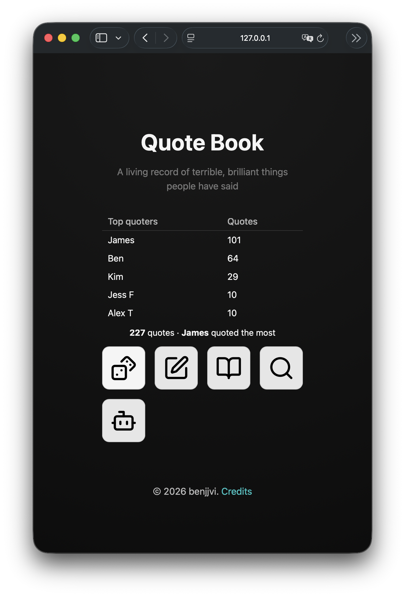

# 📖 QuoteBookWebPage

A simple **Flask‑powered web application** that lets you browse and share your Quote Book as a neat, user‑friendly web page.

This project takes your collection of quotes (like your **Spoons Quotes quote book**) and renders them in an interactive, searchable, and beautifully formatted website — perfect for sharing with friends or publishing online.

---

## 🚀 Features

- 🔍 See quotes beautifully displayed in a web interface
- 🌐 Built with **Flask** for simplicity and extensibility
- 🎨 Frontend with HTML/CSS/JS in `templates/` and `static/`
- 🐍 Python backend in `app.py`
- 📦 Easily deploy locally or on hosting like **Render / Heroku / GitHub Pages (via static export)**

---

## 🛠️ Getting Started

### 📋 Prerequisites

Make sure you have the following installed:

- Python 3.8+
- pip (Python package manager)

### 🧰 Setup

1. Clone the repo:

   ```git
   git clone https://github.com/benjjvi/QuoteBookWebPage.git
   cd QuoteBookWebPage
   ```

2. Install dependencies:

    ``` bash
   python -m pip install -r requirements.txt
   ```

3. Run the app:

    ``` bash
   python app.py
   ```

4. Open your browser and navigate to 127.0.0.1:5000

---

## 📁 Project Structure

```
QuoteBookWebPage/
├── app.py                   # Flask app entrypoint
├── templates/               # HTML templates
├── static/                  # CSS/JS/SVG assets
├── qbformats.py             # Quote parsing logic
├── ai_helpers.py            # AI helpers
├── PATTERNS.py              # NSFW patterns
├── profanities.json         # NSFW patterns
├── qb.qbf.template          # Example quote format
└──  requirements.txt         # Python dependencies
```
---

## 🎨 Screenshots

### 📸 Screenshot – Homepage



---

## 🧠 How It Works

The app:

- Loads quotes in a custom format (see `qbformats.py`)
- Uses Flask routes (in `app.py`) to serve pages
- Renders content via Jinja templates in `templates/`
- Assets like CSS and JavaScript live inside `static/`

---

## 📦 Deploying

You can deploy this app easily:

- Heroku – standard Python deploy
- Render – deploy from GitHub with auto‑deploy
- GitHub Pages – if you export as static HTML (using a build step)
- PythonAnywhere - drag and drop install.

> ⚡ GitHub Pages only serves static content — if you choose this path, you’ll need to generate static HTML first.

---

## 🤝 Contributing

1. Fork it!
2. Create your feature branch: git checkout -b feature/YourIdea
3. Commit your changes
4. Push to your fork
5. Open a Pull Request

---

## 🙌 Thanks

Made with ☕ and quotes.
This project uses icons from [Lucide](https://lucide.dev). Profanities were gathered from [this repo](https://github.com/dsojevic/profanity-list) by [dsojevic](https://github.com/dsojevic).
Happy quoting! ✨
